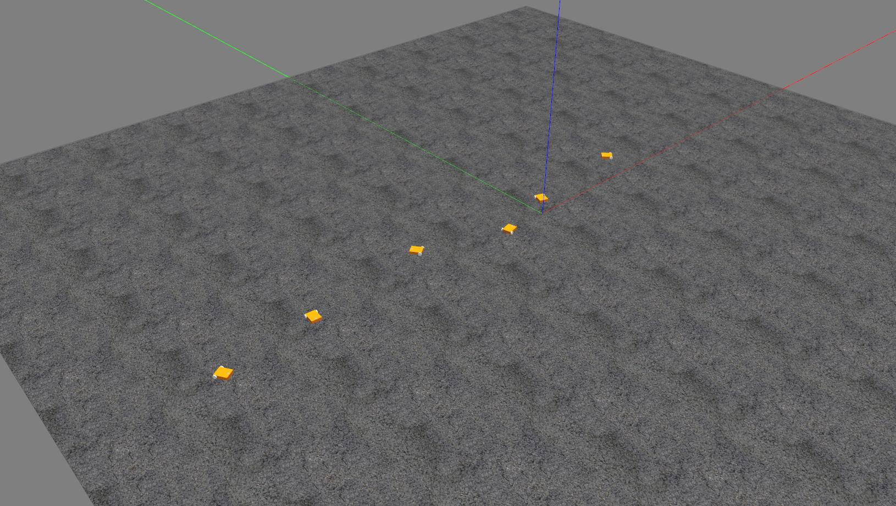
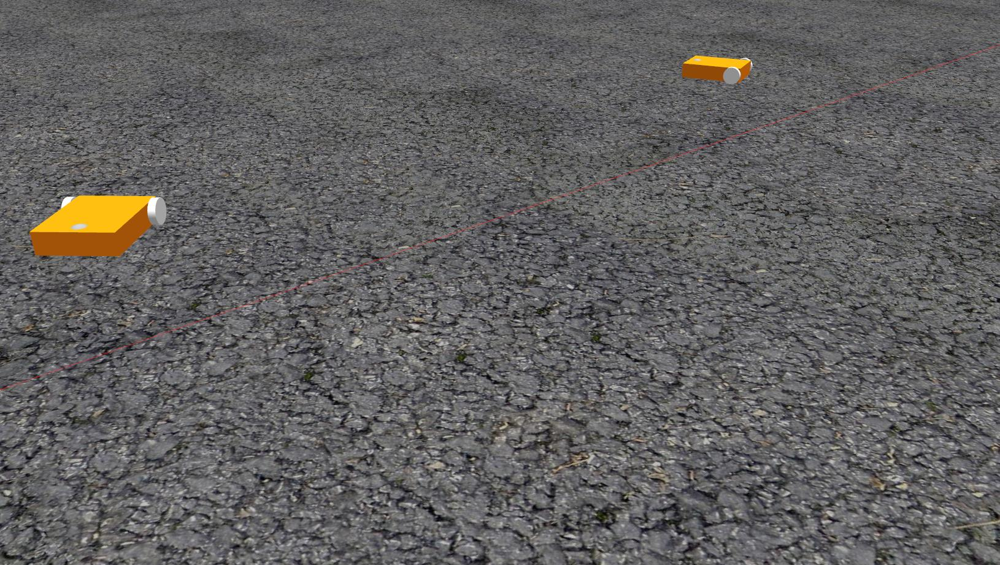
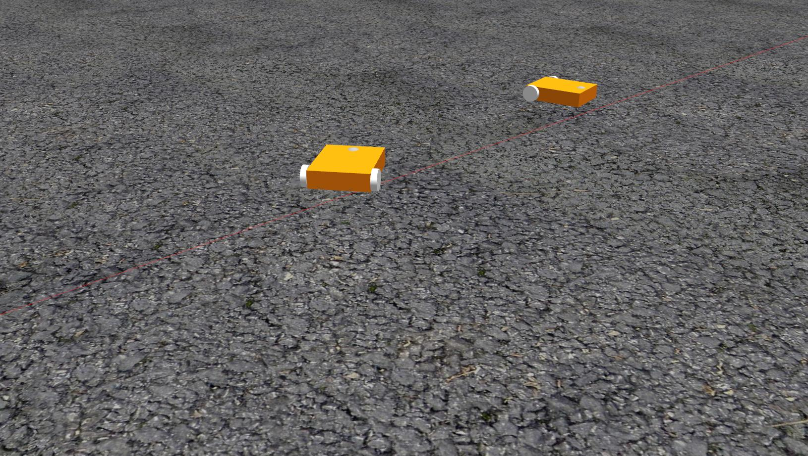
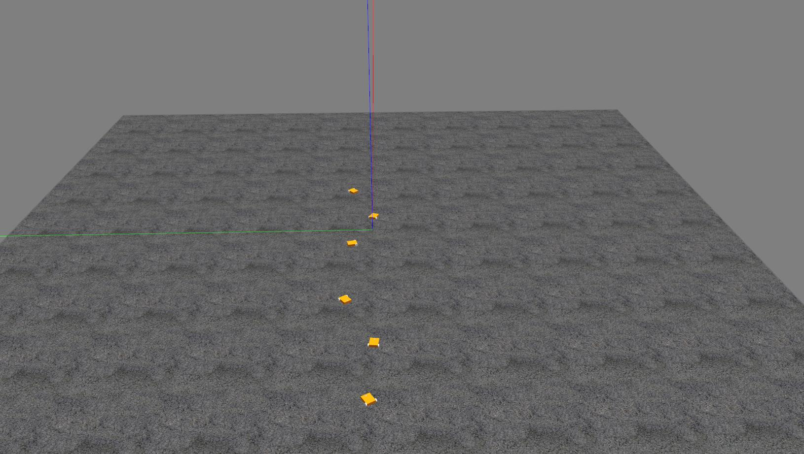
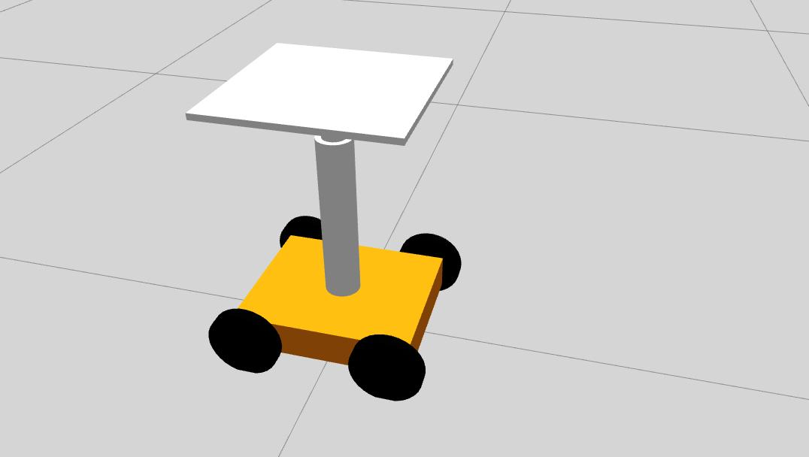

# Minion Gazebo-Ros Package 
Screenshots:

</img> </img> </img> </img> 

# 4 wheeled Minons
A four wheeled model of minion is available at https://github.com/aarg-kcis/Minion2_payload_level_gazebo


# Battery Plugin: Clone into catkin workspace src

```bash
cd <path_to_your_workspace>/src
git clone https://github.com/pooyanjamshidi/brass_gazebo_battery.git
git clone https://github.com/yujinrobot/kobuki_msgs.git
export GAZEBO_PLUGIN_PATH=${GAZEBO_PLUGIN_PATH}:~/<your_workspace>/src/brass_gazebo_battery/build/devel/lib
```
```
Find and remove/comment the following line in CMakeLists.txt of brass_gazebo_battery package

find_package(ignition-math2 REQUIRED)
```

```bash
cd <path_to_your_workspace>/
catkin_make
. devel/setup.bash
```
```
Note:(Optional) If not already added, add the catkin path in your .bashrc (or equivalent) file
```

# Actuator Plugins: Save the Gazebo_Plugins folder outside your catkin workspace
```bash
cd Gazebo_Plugins
mkdir build
cd build
cmake ../
make
export GAZEBO_PLUGIN_PATH=${GAZEBO_PLUGIN_PATH}:~/<path_to_Gazebo_Plugins>/Gazebo_Plugins/build
```
# Open a 3x3 matrix of terminals (Terminator)
First terminal:
```bash
roscore
```
Second terminal:
```bash
roslaunch minion_robot gazebo.launch world_name:=minion_world
```

Third terminal:
```bash
cd catkin_ws/src/minion_robot/scripts
./setup_gazebo.sh <num_of_robots>
```

Open a separate terminal for each robot:
```bash
 rosrun minion_robot minion.py minion <robot_ID> #Enter 1 .. <num_of_robots> in each new terminal
```

# To Kill Process:
```bash
cd catkin_ws/src/minion_robot/scripts
./cleanup.sh
```
For limits on the input velocity: Check diff_drive_controller.yaml Tutorials followed : http://wiki.ros.org/urdf/Tutorials,  http://gazebosim.org/tutorials
